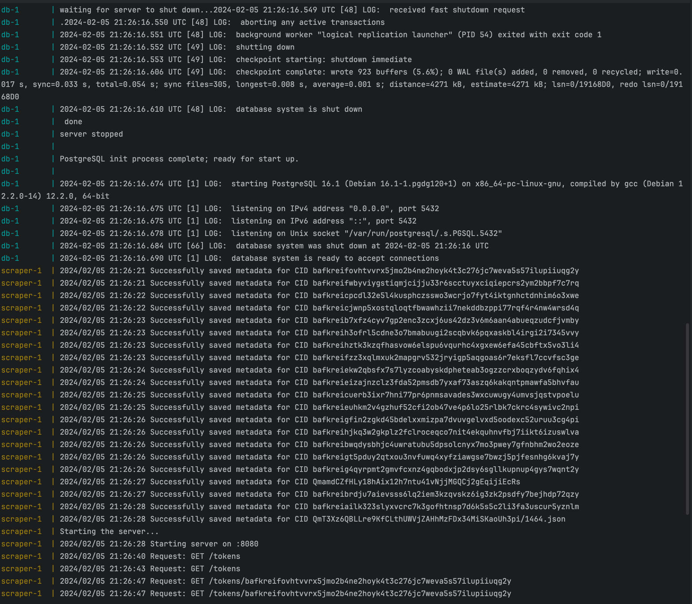
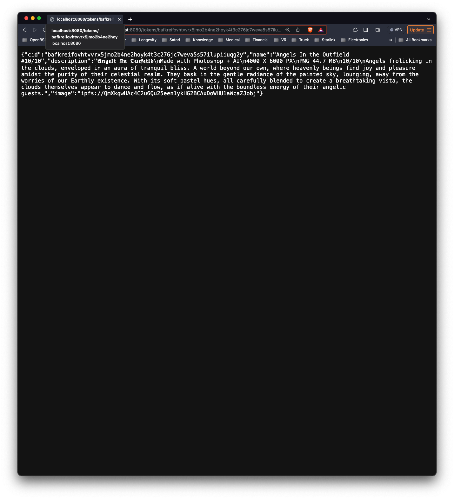
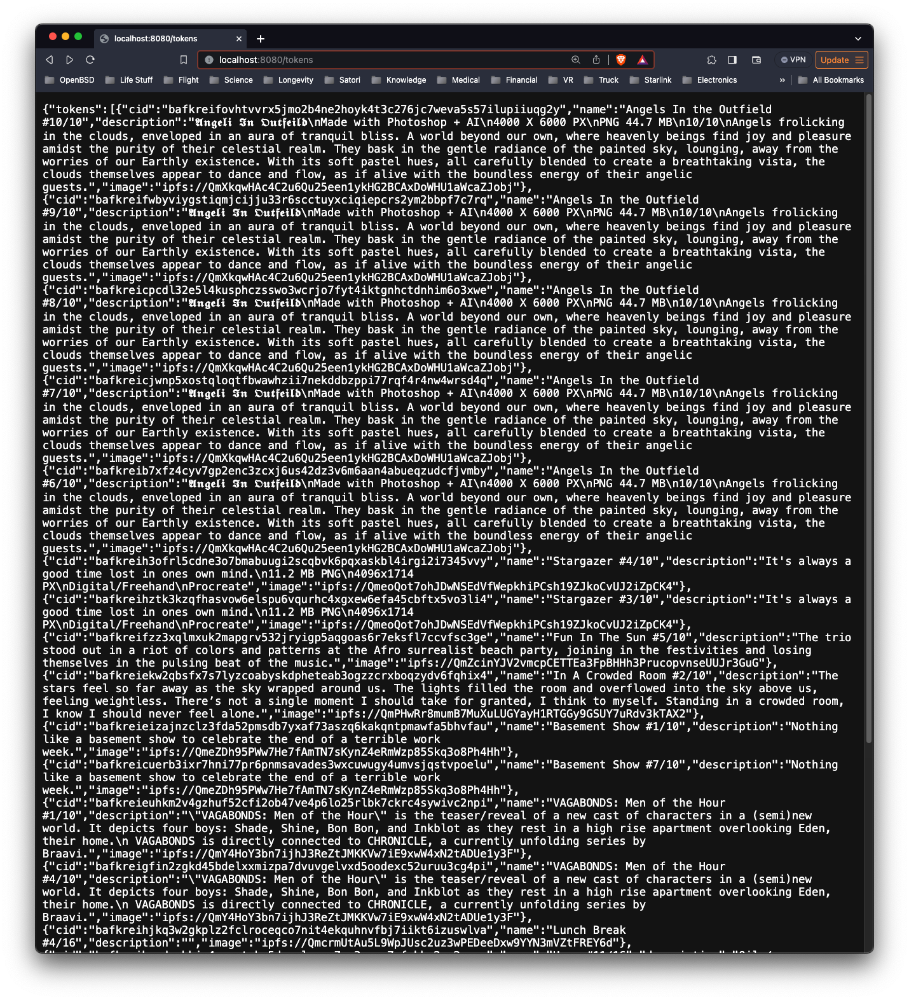

# ipfs-scraper

## Prerequisites
- Docker and Docker Compose installed on your system.
- The Docker daemon must be running.

## Steps to Run (First Time)

1. **Clone the Repository** (optional if you have the project files)
   ```bash
   git clone https://github.com/Xaxis/ipfs-scraper
   cd ipfs-scraper
   ```
   
2. **Build the Docker Image & Run the Containers**
   ```bash
    docker-compose up --build
    ```
   
3. **Verify the Application is Running**
   - Ensure that both the application and database containers are running by looking at the CLI output.
   - The API will be accessible at http://localhost:8080 (if you get a 404 message, it's working!).

4. **Shutting Down**
   ```bash
   docker-compose down
   ```
   
## Steps to Run (Subsequent Times)

1. **Clear volumes** (run this if you want to start fresh)
   ```bash
   docker-compose down -v
   ```
   
2. **Start the Containers**
   ```bash
   docker-compose up --build
   ```
   
## Verifying the Scraper and API Server are Working

1. **Query the API**
    - You can view the logs of the running containers by running the following command:
      ```bash
      curl http://localhost:8080/tokens
      curl http://localhost:8080/tokens/bafkreiekw2qbsfx7s7lyzcoabyskdpheteab3ogzzcrxboqzydv6fqhix4
      ```
    - Or of course you can use your browser to access the API.
      
2. **View the Logs**
   - You can view the logs of the running containers by running the following command:
     ```bash
     docker-compose logs -f
     ```
     
## Examples of the Scraper and API Server Running




